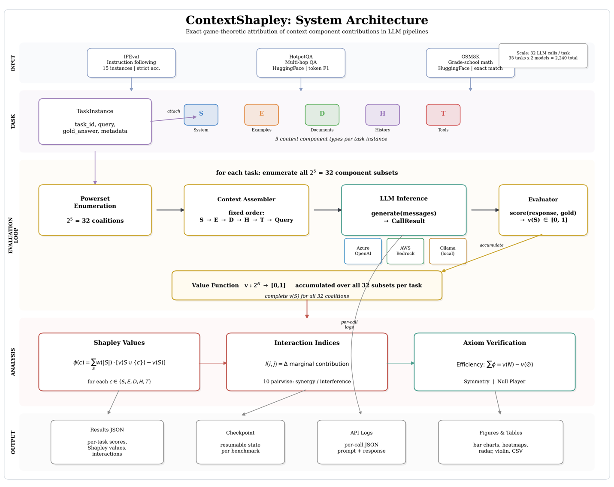

# ContextShapley

**Paper submitted to the 5th IEEE International Conference on Technology, Engineering, Management for Societal Impact using Marketing, Entrepreneurship, and Talent (TEMSMET 2026), Symbiosis International University, Hyderabad, India, 29–31 October 2026.**

> *ContextShapley: Measuring How Context Components Help or Hurt Language Model Performance*
>
> Shaik Ahamad and Dr. V B Narsimha
>
> Department of Computer Science Engineering, UCE(A), Osmania University, Hyderabad, India

---

ContextShapley is a reproducible research framework that quantifies the marginal contribution of each context component in LLM pipelines using exact Shapley values from cooperative game theory. For N=5 components, it exhaustively evaluates all 2^5 = 32 coalition subsets per task instance, measuring both individual contributions and pairwise interactions (synergy or interference).

## System Architecture



## The Five Context Components

| Code | Component | Description |
|------|-----------|-------------|
| **S** | System Instructions | Task-specific system prompt |
| **E** | Few-Shot Examples | In-context demonstrations |
| **D** | Retrieved Documents | RAG-style reference material |
| **H** | Conversation History | Prior turns in a dialogue |
| **T** | Tool Outputs | Structured tool/API results |

## Setup

Requires **Python 3.10+**.

```bash
git clone https://github.com/Ahamad-ai/ContextShapley.git
cd ContextShapley

python3 -m venv .venv
source .venv/bin/activate

pip install -e ".[dev]"

cp .env.template .env
# Edit .env with your API keys (auto-loaded by the scripts)
```

### Provider Setup

| Provider | Model | Setup |
|----------|-------|-------|
| **OpenAI** | GPT-5 | Set `OPENAI_API_KEY` in `.env` |
| **Ollama** | Qwen3:8B | Install [Ollama](https://ollama.com/download), run `ollama pull qwen3:8b && ollama serve` |
| **AWS Bedrock** | Claude | Configure via `aws configure` (optional) |

## Running Tests

All tests are pure-compute with no API calls or network required.

```bash
python -m pytest                         # all tests
python -m pytest tests/test_shapley.py   # Shapley axiom verification
python -m pytest tests/test_assembler.py # assembler correctness
python -m pytest tests/test_evaluators.py # evaluator metrics
python -m pytest tests/test_benchmarks.py # benchmark loaders
```

## Running Experiments

### Pilot Run

```bash
python experiments/run_pilot.py                      # default: 2 IFEval instances
python experiments/run_pilot.py --n-instances 1      # quick smoke test
python experiments/run_pilot.py --model gpt-5
```

### Full Run

```bash
# OpenAI (default provider is openai)
python experiments/run_full.py --benchmark ifeval --model gpt-5
python experiments/run_full.py --benchmark hotpotqa --model gpt-5
python experiments/run_full.py --benchmark gsm8k --model gpt-5

# Ollama (local, no API key needed)
python experiments/run_full.py --benchmark ifeval --provider ollama --model qwen3:8b
python experiments/run_full.py --benchmark hotpotqa --provider ollama --model qwen3:8b
python experiments/run_full.py --benchmark gsm8k --provider ollama --model qwen3:8b

# AWS Bedrock
python experiments/run_full.py --benchmark ifeval --provider bedrock --model claude-sonnet

# All benchmarks at once
python experiments/run_full.py --benchmark all --model gpt-5

# Resume from checkpoint if interrupted
python experiments/run_full.py --resume
```

CLI reference:

```bash
python experiments/run_full.py --help
```

### Analysis

```bash
# Single benchmark analysis (generates plots + CSV)
# For new runs, results are saved under: results/raw/<benchmark>_<model_tag>/
python experiments/analyze_results.py results/raw/ifeval_gpt-5/ifeval_gpt-5_results.json

# Cross-benchmark analysis
python experiments/analyze_full.py

# Cross-model comparison (GPT-5 vs Qwen3:8B)
python experiments/analyze_crossmodel.py
```

## Project Structure

```
ContextShapley/
├── contextshapley/              # Core library
│   ├── __init__.py
│   ├── assembler.py             # Builds chat prompts from component subsets
│   ├── shapley.py               # Exact Shapley value + interaction computation
│   ├── evaluators.py            # Scoring functions (F1, exact match, GSM8K)
│   ├── profiler.py              # Profiler stub
│   └── models/
│       ├── __init__.py
│       └── openai_wrapper.py    # OpenAI, Bedrock, and Ollama backends
├── benchmarks/                  # Benchmark loaders
│   ├── ifeval.py                # 15 instruction-following instances (self-contained)
│   ├── hotpotqa.py              # Multi-hop QA (HuggingFace datasets)
│   └── gsm8k.py                 # Math reasoning (HuggingFace datasets)
├── experiments/                 # Experiment and analysis scripts
│   ├── run_pilot.py             # Quick pilot (2 instances, 64 calls)
│   ├── run_full.py              # Full benchmark run with checkpoint resume
│   ├── analyze_results.py       # Per-benchmark analysis
│   ├── analyze_full.py          # Cross-benchmark analysis
│   └── analyze_crossmodel.py    # Cross-model comparison
├── tests/                       # Unit tests (no API calls required)
├── results/
│   ├── raw/                     # Per-call JSON logs and result files
│   └── figures/                 # Generated plots and CSV tables
├── figures/                     # Paper figures
├── pyproject.toml               # Package configuration and dependencies
├── .env.template                # Environment variable template
├── .gitignore
└── README.md
```

## Benchmarks

| Benchmark | Instances | Task Type | Metric | Source |
|-----------|-----------|-----------|--------|--------|
| IFEval | 15 | Instruction following | Strict binary accuracy | Self-contained |
| HotpotQA | 10 | Multi-hop knowledge QA | Token-level F1 | HuggingFace `hotpot_qa` |
| GSM8K | 10 | Math word problems | Exact numeric match | HuggingFace `openai/gsm8k` |

## Key Results

| Finding | Detail |
|---------|--------|
| System instructions dominate IFEval | mean phi(S) = 0.541, acting as a "dictator" component |
| Retrieved documents harm GSM8K | Negative in 100% of non-trivial cases (phi(D) = -0.065) |
| Strong D x T interference on HotpotQA | I = -0.222, combining documents and tools can be destructive |
| Weaker models are more S-dependent | Qwen3:8B phi(S) = 0.811 vs GPT-5 phi(S) = 0.541 on IFEval |
| Experiment scale | 2,240 LLM calls (35 tasks x 32 coalitions x 2 models) |

## Pre-computed Results

All 2,240 raw experiment results (per-call JSON logs with prompts, responses, scores, Shapley values, and interaction indices) are included in `results/raw/`. You can re-run the analysis scripts without any API calls:

```bash
python experiments/analyze_full.py
python experiments/analyze_crossmodel.py
```

## Citation

If you use this framework, please cite:

```
S. Ahamad and V. B. Narsimha, "ContextShapley: Measuring How Context Components
Help or Hurt Language Model Performance," submitted to 5th IEEE International
Conference on Technology, Engineering, Management for Societal Impact using
Marketing, Entrepreneurship, and Talent (TEMSMET 2026), Hyderabad, India, 2026.
```

## License

This project is for academic research purposes.
